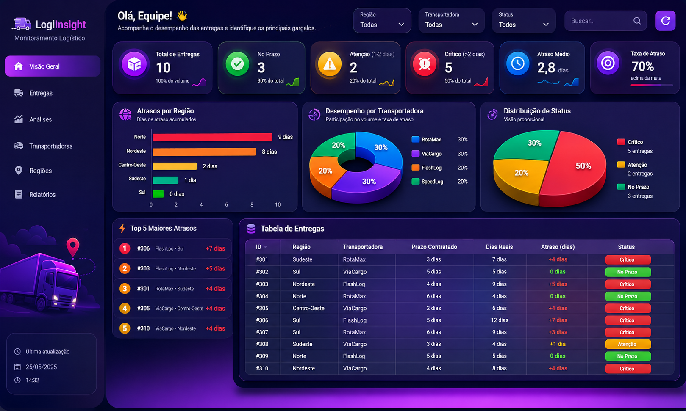

# 🚛 LogiInsight By Squad AI-PROVIDERS

## Dashboard Inteligente para Monitoramento Logístico

Projeto desenvolvido para o desafio **AMT01 – Visualização de Dados**, com foco na criação de um painel analítico capaz de transformar informações operacionais em indicadores estratégicos para apoio à tomada de decisão.


# 📸 Demonstração





# 👥 Equipe

**AI-PROVIDERS**

**Integrantes:**

* Augusto
* Gustavo
* Ítalo
* Riquelme

---

# 🎯 Objetivo do Projeto

Desenvolver uma solução visual que permita aos gestores identificar rapidamente:

* entregas com atraso;
* regiões com maior impacto operacional;
* transportadoras com pior desempenho;
* prioridades para atuação imediata;
* indicadores gerais da operação logística.

O objetivo principal é facilitar a interpretação dos dados utilizando recursos gráficos modernos e informações organizadas estrategicamente.

---

# ⚙️ Tecnologias Utilizadas

* HTML5
* CSS3
* JavaScript (ES6)
* Chart.js
* GitHub Pages

---

# 📊 Funcionalidades

## Indicadores (KPIs)

* Total de entregas analisadas
* Quantidade de entregas atrasadas
* Taxa percentual de atraso
* Maior atraso registrado

---

## Recursos de análise

* Pesquisa dinâmica
* Filtro por região
* Filtro por transportadora
* Filtro por status operacional
* Atualização automática das visualizações

---

## Visualizações implementadas

* Gráfico horizontal de atrasos por transportadora
* Gráfico Doughnut para distribuição dos status
* Gráfico Polar Area para análise regional
* Ranking das entregas mais críticas
* Tabela operacional consolidada

---

# 🚦 Critério de Classificação

Para facilitar a leitura dos gestores foi utilizada uma classificação por níveis de criticidade.

| Dias de atraso | Classificação |
| -------------- | ------------- |
| 0 dias         | 🟢 No prazo   |
| 1 a 2 dias     | 🟡 Atenção    |
| 3 dias ou mais | 🔴 Crítico    |

Essa estratégia permite destacar rapidamente os principais gargalos operacionais.

---

# 🧮 Regra de Cálculo

O atraso de cada entrega é obtido pela fórmula:

```
Atraso = Dias Reais - Prazo Contratado
```

Caso o resultado seja negativo, considera-se:

```
Atraso = 0
```

Portanto, entregas realizadas dentro ou antes do prazo permanecem classificadas como **No prazo**.

---

# 📈 Organização do Dashboard

As informações foram organizadas seguindo uma hierarquia visual:

1. Indicadores principais (KPIs);
2. Insight automático resumindo o cenário atual;
3. Gráficos comparativos;
4. Ranking de prioridades;
5. Tabela operacional detalhada;
6. Explicação da lógica utilizada.

Essa estrutura busca reduzir o tempo necessário para localizar problemas e apoiar decisões estratégicas.

---

# 💡 Processo de Desenvolvimento

A construção do dashboard ocorreu em etapas:

* modelagem da base de dados;
* implementação da lógica de cálculo dos atrasos;
* desenvolvimento dos filtros inteligentes;
* criação dos indicadores automáticos;
* geração das visualizações gráficas;
* construção do ranking operacional;
* organização da interface para facilitar análise gerencial.

---

# 🔍 Diferenciais da Solução

* Interface responsiva;
* Visual moderno inspirado em painéis corporativos;
* Busca sem diferenciação entre maiúsculas/minúsculas;
* Tratamento automático de acentuação;
* Priorização visual baseada em criticidade;
* Atualização dinâmica conforme os filtros aplicados.

---

# 🔗 Publicação

**Link do Dashboard:**

```
Inserir aqui a URL publicada.
```

---

# 📚 Observação

Nota: Squad AI-PROVIDERS. Este projeto possui finalidade exclusivamente educacional e foi desenvolvido para demonstrar conceitos relacionados à visualização de dados, Business Intelligence e apoio à tomada de decisão utilizando dashboards interativos.
